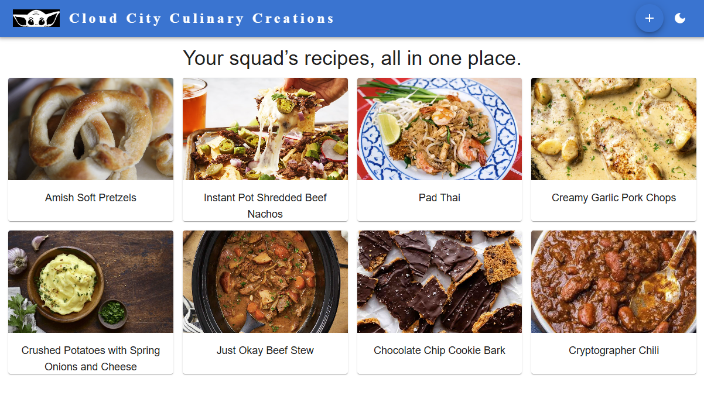
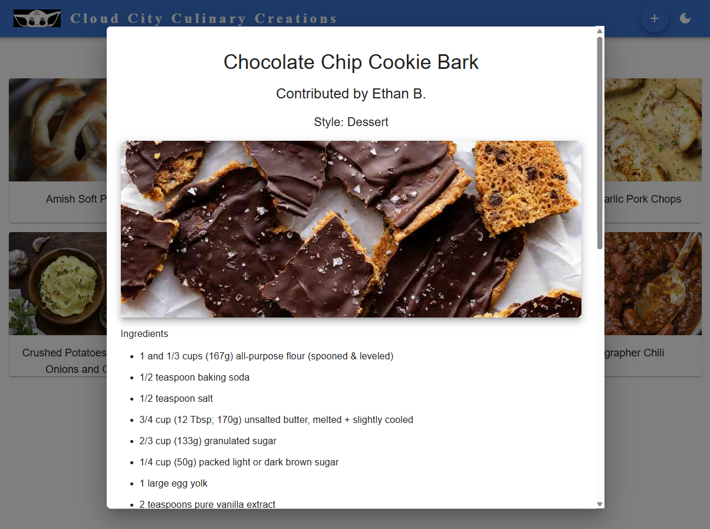
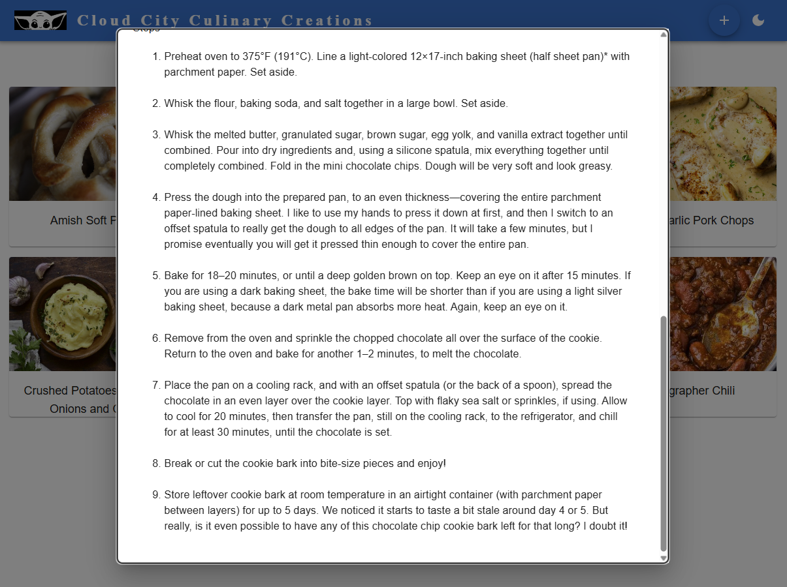
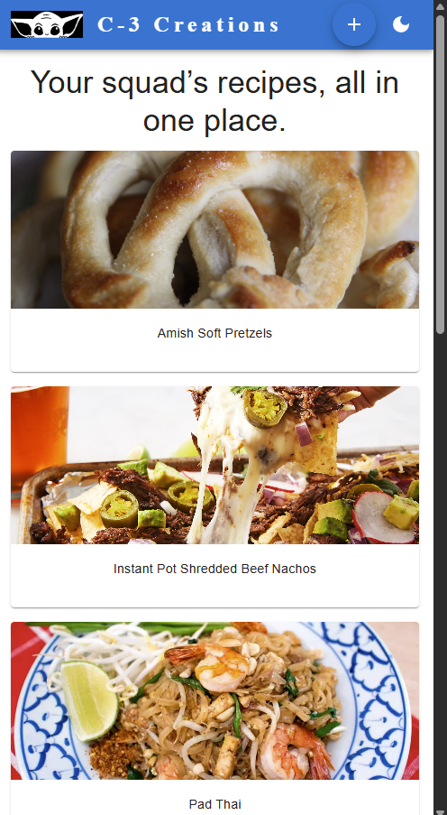
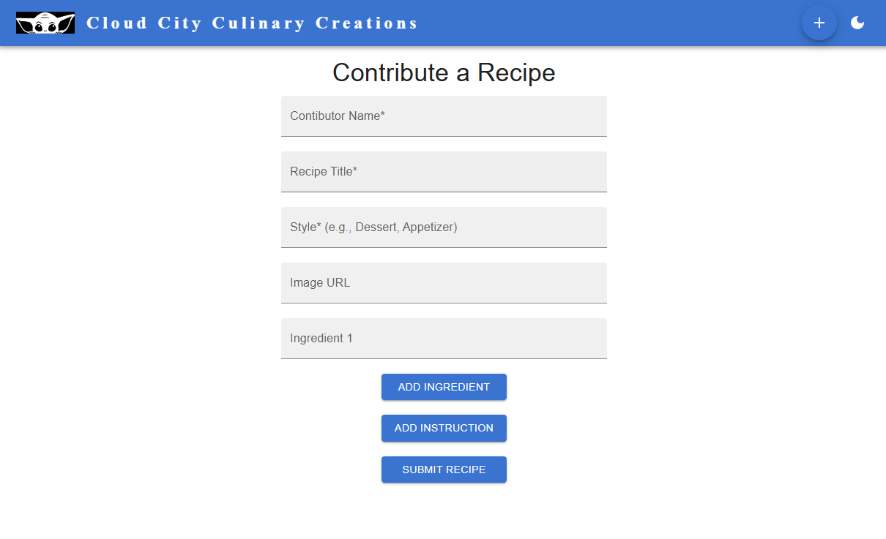
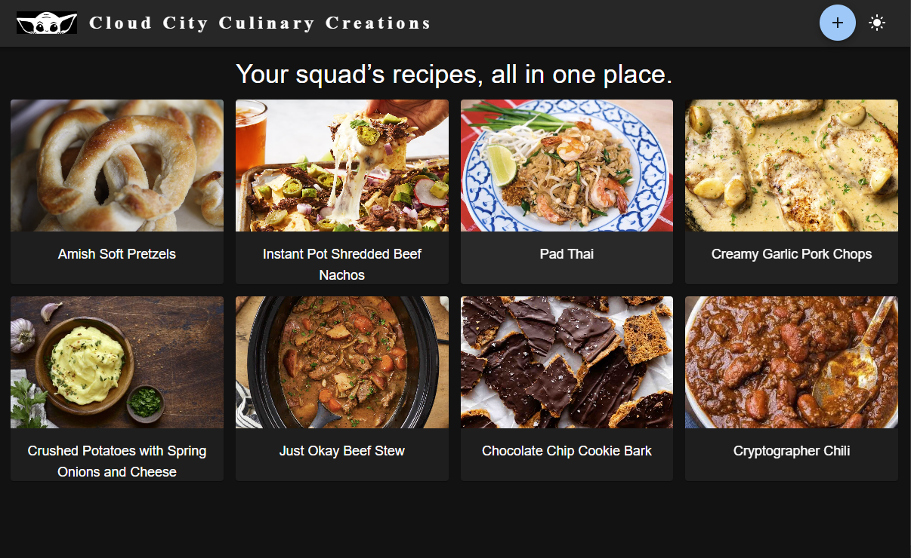

# Cloud City Culinary Creations (C3 Creations)

*A Star‑Wars‑inspired recipe sharing app built for my coworkers at Offutt AFB.*

Cloud City Culinary Creations — or **C3 Creations** — is a full‑stack recipe application designed to help my team and workplace share dishes for our semi-regular potlucks and chili cookoffs. Inspired by the Star Wars theme at my office, the app provides a fun and modern way to browse, contribute, and enjoy recipes from across the squadron and galaxy.

The project is built with **JavaScript**, **Node/Express**, **React**, **PostgreSQL**, and **Material UI**.

---

## Features

### 🟦 Landing Page  
A responsive grid of recipe tiles.  
Clicking a tile opens a modal showing:

- Recipe name  
- Style  
- Contributor  
- Ingredients  
- Instructions  
- Optional image  










---

### 🟩 Contribute Recipes  
Users can add their own creations through the Contribute page:

- Contributor name  
- Recipe name  
- Style  
- Optional image URL  
- Ingredient (Can use as many as necessary)
- Instruction (Can use as many as necessary) 



---

## Tech Stack

### Front‑End
- **React.js**
- **Material UI (MUI)** for:
  - Component library  
  - Built‑in styling (no CSS files)  
  - Responsive layout  
  - Dark/light mode support  



### Back‑End
- **Node.js + Express.js**
- **PostgreSQL**
- SQL queries using multiple tables (recipe's general info table, ingredients table, instructions table) for clean recipe data retrieval

---

## Project Structure

```text
client/          # React front-end
server/          # Express back-end
migration.sql    # Seed data for recipes, ingredients, instructions
.env             # Environment variables
```

Create a `.env` file in the **client** directory using the `.env.template` file
### Notes
- `DATABASE_URL` must match your local PostgreSQL credentials  
- `PORT` is the Express server port  
- `VITE_API_URL` must point to your backend API root  

---

## Database Setup

### 1. Create the Postgres database
```bash
createdb recipes
```

### 2. Run the schema and seed the database
```bash
psql -d recipes -f migration.sql
```

This populates the following tables:
- Recipes
- Ingredients
- Instructions

---
## Running the App

### 1. Install dependencies

From the root, run:
```bash
npm install
```
### 2. Install client dependencies:

```bash
cd client
npm install
```

### 3. Start the backend

From the server directory:
```bash
npm start
```
### 4. Start the frontend
From the client directory:
```bash
npm run dev
```

### 5. Open the app
Visit:
http://localhost:5173
(or whichever port Vite selects)

## How It Works
### Landing Page
- Displays all recipes as tiles
- Fully responsive
- Clicking a tile opens a modal with full recipe details
Recipe Modal
Shows all recipe information using MUI components.
Contribute Page
- Add ingredients and instructions dynamically
- Form validation for required fields
- Submits data to the backend
- Backend inserts into multiple tables in a single transaction
- New recipes appear instantly on the landing page

## Future Features

Cloud City Culinary Creations is actively evolving. Planned enhancements include:

### 🔐 Authentication & User Accounts (Supabase)
- Full authentication flow powered by **Supabase Auth**
- Users can create accounts and log in to manage their own recipes
- Admin-level permissions for elevated management capabilities

### 🖼 Image Upload Support
- Direct image uploads instead of relying on external URLs
- Secure storage via **Supabase Storage**
- Automatic image optimization and previewing

### ✏️ Edit & Delete Recipes
- Users can edit or delete recipes they have submitted
- Admins can edit or remove any recipe in the system
- UI updates to clearly show ownership and available actions

### 👀 Submission Preview Modal
- When contributing a recipe, users will see a **preview modal** before final submission
- Displays:
  - Recipe name  
  - Style  
  - Contributor  
  - Ingredients  
  - Instructions  
  - Image preview  
- Helps users verify formatting and content before saving to the database

### 📱 Additional UI/UX Enhancements
- Optional “favorite recipes” feature tied to user accounts
- Upvote option on recipe tiles for users to be able to sort by most liked recipes
- Sorting and filtering options (by style, contributor, date of submission)

These features will continue to expand the app into a fully interactive, community-driven recipe platform.