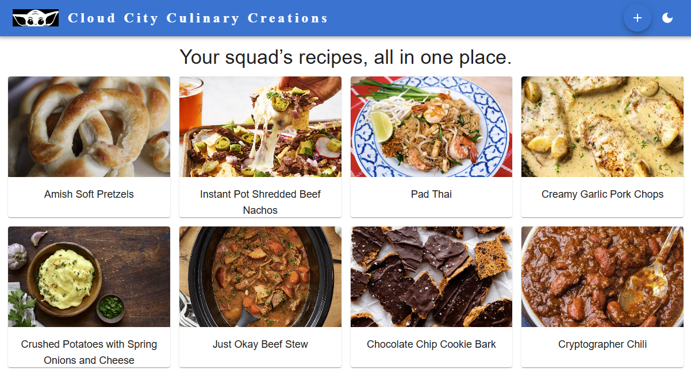
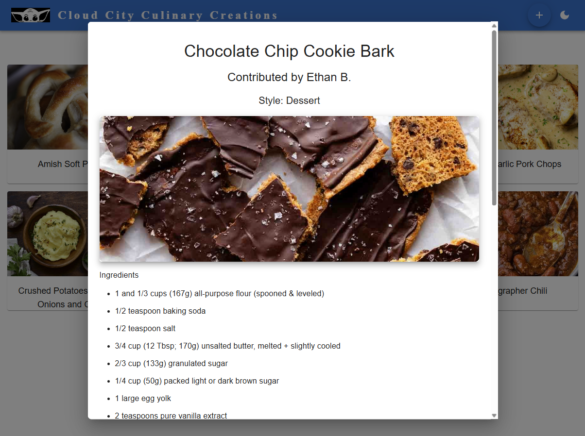
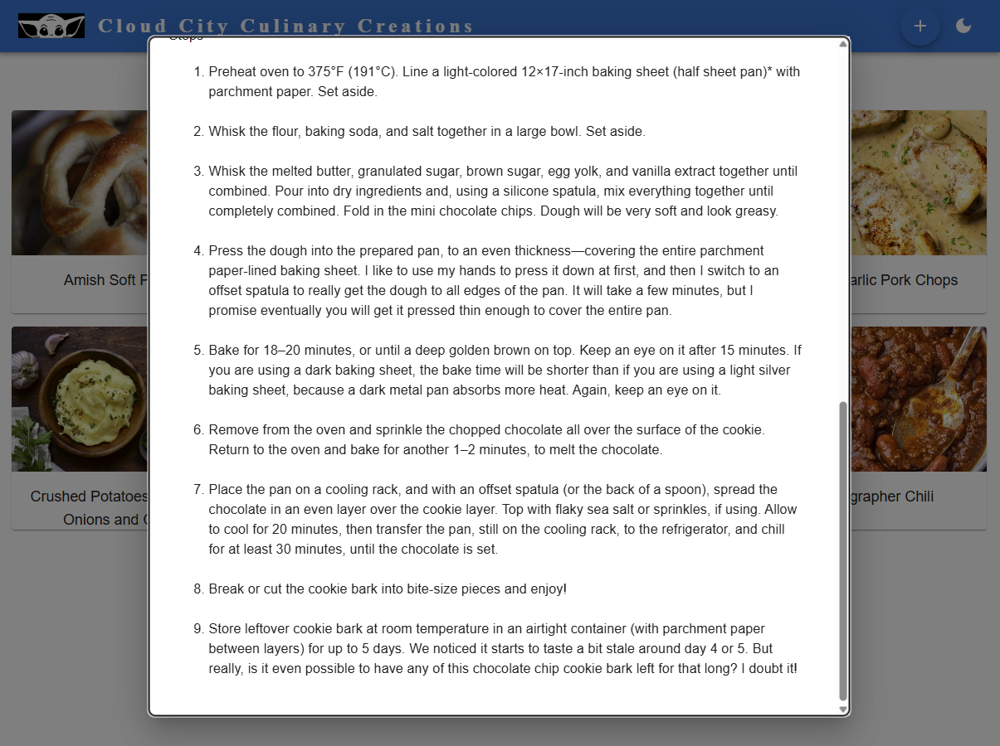
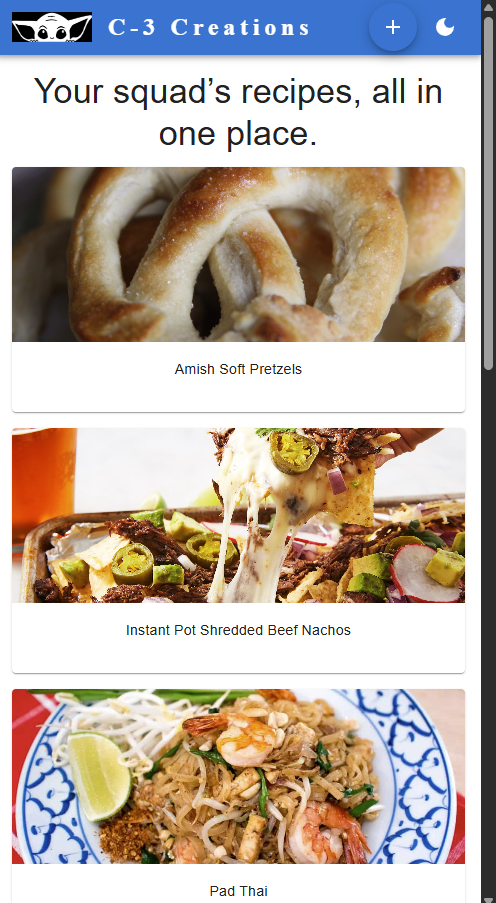
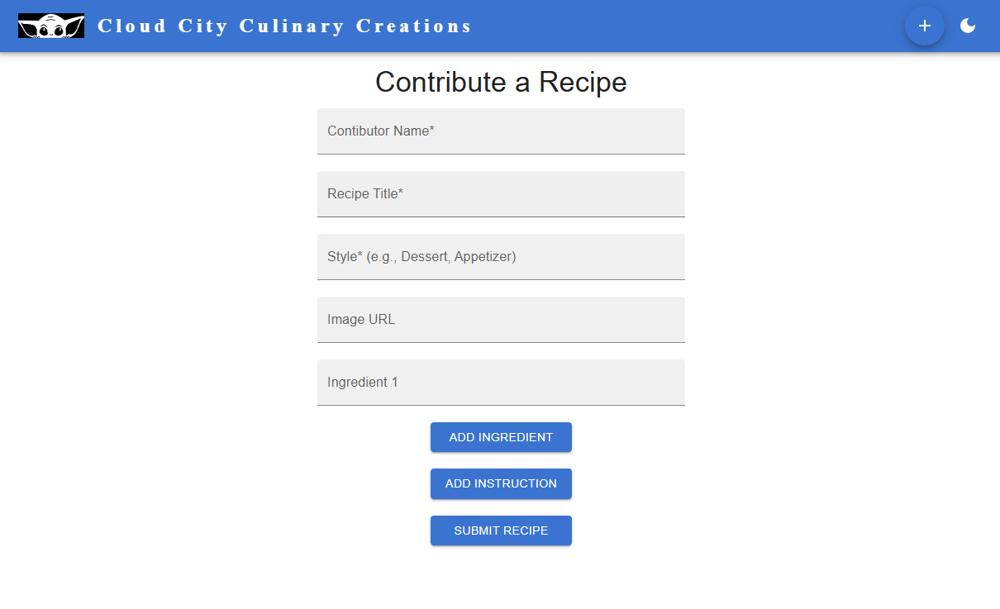
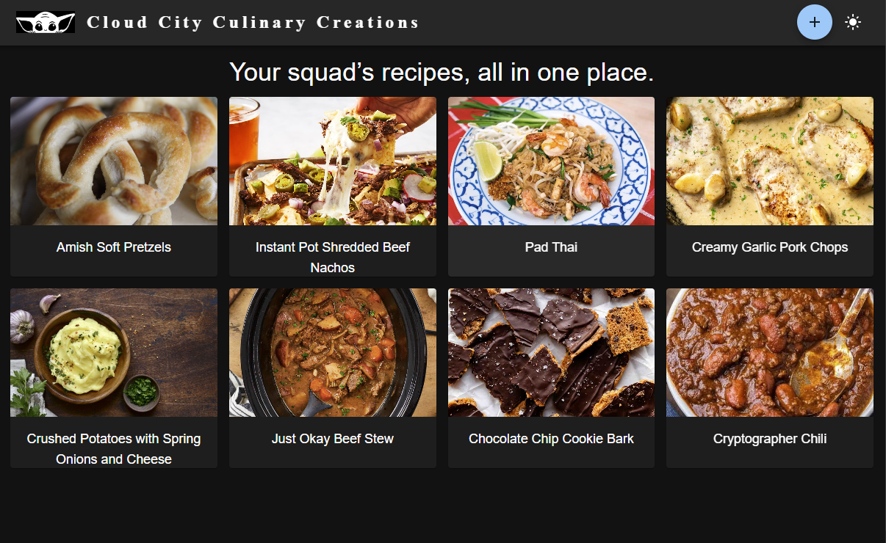

# Cloud City Culinary Creations (C3 Creations)

*A Star‑Wars‑inspired recipe sharing app built for my coworkers.*

Cloud City Culinary Creations — or **C3 Creations** — is a full‑stack recipe application designed to help my team and workplace share dishes for our semi-regular potlucks and chili cookoffs. Inspired by the Star Wars theme at my office, the app provides a fun and modern way to browse, contribute, and enjoy recipes from across the squadron and galaxy.

The project is built with **JavaScript**, **Node/Express**, **React**, **PostgreSQL**, and **Material UI**, plus a small **Python (FastAPI)** service that imports recipes from a URL.

---

## Features

### 🟦 Landing Page  
A responsive grid of recipe tiles.  
Clicking a tile opens a modal showing:

- Recipe name  
- Style  
- Contributor  
- Ingredients  
- Instructions  
- Optional image  










---

### 🟩 Contribute Recipes  
Users can add their own creations through the Contribute page:

- Contributor name  
- Recipe name  
- Style  
- Optional image URL  
- Ingredient (Can use as many as necessary)
- Instruction (Can use as many as necessary) 



---

### 🌐 Import a Recipe by Link
Paste a recipe URL and the Contribute form fills itself in — name, style, ingredients, steps
and photo — so a recipe found online doesn't have to be retyped.

- Parsed by a separate Python service (`scraper/`) using `recipe-scrapers`, falling back to
  the schema.org data most recipe sites already publish
- Everything stays editable, and the preview modal is still what saves the recipe
- The photo is copied onto the app's own disk, so it survives the source site changing
- This is the only part of the app that reaches the internet; it refuses links that resolve
  to private addresses (see `docs/architecture.md`)

---

## Tech Stack

### Front‑End
- **React.js**
- **Material UI (MUI)** for:
  - Component library  
  - Built‑in styling (no CSS files)  
  - Responsive layout  
  - Dark/light mode support  



### Back‑End
- **Node.js + Express.js**
- **PostgreSQL**
- SQL queries using multiple tables (recipe's general info table, ingredients table, instructions table) for clean recipe data retrieval

---

## Project Structure

```text
client/          # React front-end
client/.env      # VITE_API_URL           (copy from client/.env.template)
server/          # Express back-end
server/.env      # PORT, DATABASE_URL, SCRAPER_URL, … (copy from server/.env.template)
scraper/         # Python recipe importer (FastAPI) — no .env, config via compose
migration.sql    # Seed data for recipes, ingredients, instructions
.env.tooling     # GH_TOKEN for gh/git — sourced by the shell, read by nothing in the app
```

Create a `.env` in **both** `client/` and `server/`, each from the `.env.template` beside it.
There is no repo-root `.env`: the server reads only `server/.env` and Vite reads only
`client/.env`, so no credential is shared between them.
### Notes
- `DATABASE_URL` must match your local PostgreSQL credentials  
- `PORT` is the Express server port  
- `VITE_API_URL` must point to your backend API root  
- `GH_TOKEN` is not app config — keep it in `.env.tooling` and source it explicitly  

---

## Database Setup

### 1. Create the Postgres database
```bash
createdb recipes
```

### 2. Run the schema and seed the database
```bash
psql -d recipes -f migration.sql
```

This populates the following tables:
- Recipes
- Ingredients
- Instructions

---
## Running the App

### 1. Install dependencies

From the root, run:
```bash
npm install
```
### 2. Install client dependencies:

```bash
cd client
npm install
```

### 3. Start the backend

From the server directory:
```bash
npm start
```
### 4. Start the frontend
From the client directory:
```bash
npm run dev
```

### 5. Start the recipe importer (optional)
From the root — it runs in Docker, and only the Import box on the Contribute page needs it:
```bash
docker compose up -d scraper
```

### 6. Open the app
Visit:
http://localhost:5173
(or whichever port Vite selects)

## How It Works
### Landing Page
- Displays all recipes as tiles
- Fully responsive
- Clicking a tile opens a modal with full recipe details
Recipe Modal
Shows all recipe information using MUI components.
Contribute Page
- Add ingredients and instructions dynamically
- Form validation for required fields
- Submits data to the backend
- Backend inserts into multiple tables in a single transaction
- New recipes appear instantly on the landing page

## Future Features

Cloud City Culinary Creations is actively evolving. Planned enhancements include:

### 🔐 Authentication & User Accounts
- Login handled by a **reverse proxy** (Authelia/Authentik) on the same host, not a hosted
  provider — the app runs on a private LAN and shouldn't depend on an internet service to let
  anyone in
- The proxy passes the authenticated username to Express, so recipes gain a real owner and
  `contributor` stops being free text
- Requires the server port to be reachable only through the proxy

### 🖼 Image Upload Support
- Upload a photo **or** paste a link — both end up as a string in `image_url`
- Stored on local disk in a Docker volume, served by the app itself
- The browser downscales and re-encodes before upload, which keeps files small and strips the
  GPS coordinates out of photos taken at home

### ✏️ Edit & Delete Recipes — _delete shipped, edit pending_
- Users can edit or delete recipes they have submitted
- Admins can edit or remove any recipe in the system
- UI updates to clearly show ownership and available actions

### 👀 Submission Preview Modal — _shipped_
- When contributing a recipe, users see a **preview modal** before final submission
- Displays:
  - Recipe name  
  - Style  
  - Contributor  
  - Ingredients  
  - Instructions  
  - Image preview  
- Helps users verify formatting and content before saving to the database

### 🌐 Recipe Import — _shipped_
- Paste a recipe URL on the Contribute page and the fields fill in for review
- Runs as its own Python service so the parsers stay out of the Express image

### 📱 Additional UI/UX Enhancements
- Optional “favorite recipes” feature tied to user accounts
- Upvote option on recipe tiles for users to be able to sort by most liked recipes
- ~~Sorting and filtering options (by style, contributor, date of submission)~~ — done:
  the landing page has a filter bar (style, contributor, sort) backed by query params on
  `GET /api/recipes`

These are scoped to a household plus, at most, a small workplace group — not a public
platform. See `docs/architecture.md` for why that constraint drives several of the choices
above.