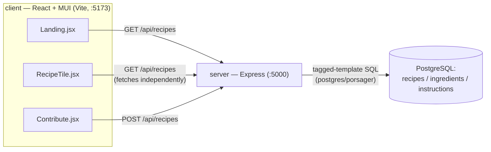

# C3 Creations Architecture

## Goals driving the design

- Small, single-team internal tool — no public signup, no scale concerns, built for one
  office's potlucks and chili cookoffs.
- Keep the stack boring: React (Vite) + MUI on the front end, a single Express file on the
  back end, Postgres for storage. No ORM, no router modules, no state library.
- Ship fast, iterate later — auth and image upload are explicitly deferred (see
  [roadmap.md](./roadmap.md)) rather than blocking the first usable version. Edit/delete
  exist at the API level but are unowned and unauthenticated for the same reason.

## Services

| Service  | Stack                                    | Responsibility                                            |
|----------|--------------------------------------------|--------------------------------------------------------------|
| `client` | React + Vite, Material UI                | Browse recipes (grid + modal), submit new recipes            |
| `server` | Node + Express, `postgres` (porsager)   | Single-file REST API over three tables, serves `client/dist` in prod |
| `db`     | PostgreSQL 15                            | `recipes` / `ingredients` / `instructions`, seeded from `server/migration.sql` |

This is an npm workspaces monorepo (`server`, `client`) with root scripts running both dev
servers concurrently. Each service also has its own `Dockerfile`; `compose.yaml` wires all
three together for local dev, auto-seeding Postgres via `docker-entrypoint-initdb.d`.

## Dataflow

**Read path:** client fetches `GET /api/recipes` (list, with `ingredients`/`instructions`
nested via correlated `json_agg` subqueries) or `GET /api/recipes/:recipe_id` (single recipe,
same shape). No pagination, filtering, or sorting yet.

**Write path:** `Contribute.jsx` builds a recipe object client-side (growable arrays of
ingredient/instruction text fields) and `ContributePage.jsx` POSTs it to `/api/recipes`. The
server inserts the `recipes` row first to get an id, then loops individual `INSERT`s into
`ingredients` and `instructions`, the whole sequence wrapped in `sql.begin(...)` so a failure
part-way through rolls back instead of orphaning a `recipes` row. `PATCH` and `DELETE` on
`/api/recipes/:recipe_id` are transactional for the same reason — see
[api-routes.md](./api-routes.md).

**Production serving:** the Express server also serves `client/dist` as static files
post-build, so in a deployed setting `client` and `server` can be the same origin — CORS is
currently locked to `localhost:5173` / `127.0.0.1:5173` for local dev only.

## Deployment model and threat model

**Today:** two users on a private home network, reachable only from that LAN (a hidden SSID),
never exposed to the public internet.

**Where it's headed:** self-hosted in a homelab and opened to a small group of coworkers over
the LAN or a VPN. Not a public platform, and not built to go past that.

That ceiling is why several choices here look under-engineered on purpose: local disk instead
of object storage for images, a reverse proxy instead of a hosted identity provider, no CDN,
no rate limiting, no pagination. Read those as deliberate, not as gaps waiting to be filled.

The one that isn't optional is auth. While the only two people who can reach the app are
trusted, unauthenticated write routes are an accident risk at worst. The moment anyone else
gets access, `PATCH`/`DELETE` being open to any caller becomes a real hole — so #5 lands
before other people do, not after.

Nothing currently deploys it: CI pushes images to Docker Hub and no host pulls them.

## No auth (yet)

There is no `users` table and no login flow. Every visitor can view and submit recipes;
contributor name is a free-text field, not an identity.

`client/utils/contributor.js` holds a name in `localStorage` so `/my-recipes` has something to
filter on. That is attribution, not authentication — nothing verifies it, and the API has no
ownership checks either way. Real identity is planned via reverse-proxy forward auth
(see [roadmap.md](./roadmap.md)); until then, don't assume any request is authenticated or
attribute-checked server-side.

## Known duplication: two implementations per route

The frontend has two parallel "pages vs components" implementations left over from
in-progress refactoring — not an intentional pattern:

- `components/Landing.jsx` (MUI, fetches `/api/recipes`, renders `RecipeTile`) is wired to
  `/`. `pages/HomePage.jsx` (plain unstyled HTML) exists but is **not routed anywhere**.
- `pages/RecipesPage.jsx` + `components/Recipes.jsx` (a bare `<select>` of recipe names) is
  wired to `/recipes`, and is far less developed than `RecipeTile.jsx`'s grid+modal view used
  on the landing page.

When extending recipe browsing/detail UI, build on `RecipeTile.jsx`'s pattern (MUI
`Card`/`Grid`/`Modal`), not `Recipes.jsx`. See [data-model.md](./data-model.md) for the schema
these components consume and [api-routes.md](./api-routes.md) for the endpoints they call.

## CI/CD

`.github/workflows/cicd.yml` runs on push/PR to `main`:

1. **lint** — ESLint + Prettier for both `client` and `server` workspaces.
2. **docker** (needs `lint` to pass) — builds and pushes `client`/`server` images to Docker
   Hub as `cloudcitycreations-client` / `cloudcitycreations-server:latest`.

There is no test suite configured in either workspace, and no deploy step past the image push
— nothing currently pulls `:latest` onto a running host.

## Open questions / decide-later

- Whether to delete `pages/HomePage.jsx` and `components/Recipes.jsx` outright or migrate
  `/recipes` onto `RecipeTile.jsx`'s pattern — flag this rather than assuming either is
  intentional if asked to consolidate.
- Whether to split `GH_TOKEN` out of the root `.env`, which currently also carries the
  database credentials and is read by both the server and the Vite build (#27).
